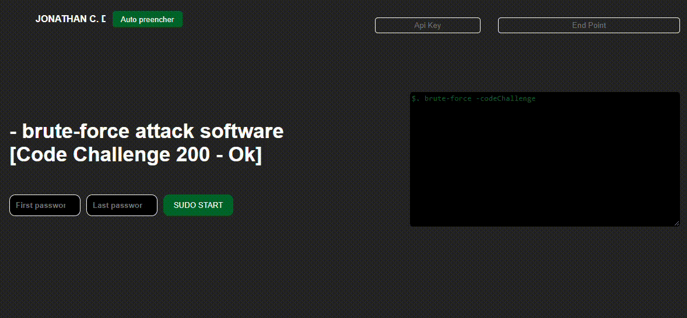

<h1 align="center">Welcome to brute-force Code Challenger </h1>


## ✨ Demo


<p align="center">
  
</p>


## 🚀 Required
  NodeJs  `v14.21.3` <br>
  Npm   `v6.14.18` 
## 🚀 About
In the Brute Force Attack soft - Code Challenge Folder, you will find two projects, one named Back and the other Front.

In the Front, you will find a project that uses pure `JS, CSS, and HTML`.
n the Back, you will find a `Node.js` project that, when executed, will initialize a `web server on port 3000`.

## 🚀 Back-end Install 


Install  `Node Server`:

```sh
npm install
```

Start  `Node Server`:

```sh
node . 
```


## 🚀 Usage

To start using the project, you will need to use the interface of the Front. It is recommended to use the `Live Server plugin for VSCode` for a better experience.

### Credencial and endpoint
The system contains a security layer where you need to provide your API Key to access the resources of the Back-end.

In the top right corner of the screen, you will see two fields: ApiKey and EndPoint. To make the API work, you need to provide the necessary data in these fields.

 ⭐️ <strong>Api key:</strong> sk_test_183097
 <br>
 ⭐️ <strong>Endpoint:</strong> http://localhost:3000/settingsBruteForce

You will also need to fill in the fields `"First password"` and `"Last password"` and then click on the `"Sudo Start" button.` The result will be printed in the simulated prompt on the right hemisphere of the project.


👤 **Jonathan Cristovão do Amaral**

- Linkedin: [Jonathan do Amaral](https://www.linkedin.com/in/jonathan-do-amaral-6195181b1/)
- Github: [@AmaralJonathan](https://github.com/AmaralJonathan)

## Show your support


## License

Copyright © 2023 [Jonathan Cristovão do Amaral](https://github.com/kefranabg).<br />


## Challenge


Question 1
Part 1
You are a security expert attempting to break into a company which paid you to
do so. By exploiting security flaws you discover that valid passwords must
follow a certain pattern.
Pattern rules:
The password must be between 184759-856920.
At least two adjacent digits must be the same (like 22 in 122346).
Starting from left to right, digits only increase or stay the same (like 111237 or
135678).
Examples:
222222 is valid (double 22, never decreases).
236775 is not valid (decreasing pair of digits 75).
345789 is not valid (no double).
Before attempting brute force you would like to know how many possible
combinations of the password can exist. How many passwords exist following
these rules?
Part 2
After rechecking your findings you noticed there was an additional rule you
missed: You must have at least one group of exactly two of the same
characters.
For Example:
334478 is valid because the digits never decrease and all repeated digits are
exactly two digits long.
347779 is not valid (the repeated 7 is adjacent three times, 777).
444557 is valid (4 is repeated more than twice but it still contains a double 55).

How many passwords exist following these rules?
